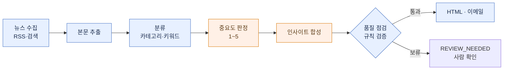

# PR Monitor — Claude Code Plugin

**마케팅·전략기획 팀을 위한 뉴스 모니터링 자동화 플러그인.**

회사 평판·경쟁사 동향은 하나라도 놓치면 안 되는 영역이라, 외신·국내 보도를 구글뉴스까지 빠짐없이 **수집 → 분류 → 중요도 판정 → 합성**해 정기 브리핑으로 만듭니다(사내 이메일 발송은 선택). 산출물은 둘입니다.

| 산출물 | 답하는 질문 | 내용 |
|---|---|---|
| **자사 보도 모니터링 (PR)** | "우리가 어떻게 보도됐나" | 자사 언급 기사 + 톤(긍/중/부) + 언급유형(직접/간접/주가) + 통계 + 월별 엑셀 |
| **업계 인사이트 뉴스레터** | "업계에 무슨 일이 — 우리는 뭘 해야 하나" | 외부 동향 + **자사 전략 시사점** |

실행할 때마다 자사·경쟁사 맥락이 `data/self-context/` 에 누적되어, 다음 브리핑의 전략 시사점이 점점 정교해집니다 — 그때그때 요약만 내놓는 도구와 다른 지점입니다.

> [!IMPORTANT]
> 로컬 **Claude Code Desktop**(Windows·macOS) 전용. 뉴스 사이트를 직접 수집하므로 네트워크가 필요합니다. **Cowork(클라우드)에서는 수집이 차단되어 동작하지 않습니다.**

## 결과물

사람들이 실제로 받는 건 아래 두 산출물입니다. *(형식 예시 — 회사·카테고리 이름은 설정에 따라 채워집니다.)*

### 업계 인사이트 뉴스레터 — `/newsletter`

```
[회사] · INDUSTRY INSIGHT            2026-06-16 · 최근 2일 · 62건 (해외 54·국내 8)
────────────────────────────────────────────────────────
TL;DR   이번 기간을 관통하는 외부 팩트 2~3개를 한 문단으로.
        그래서 자사에 무엇이 달라지는지 한 문단 (확인 안 된 건 "확인 대상").

경쟁사 동향
  [경쟁사A]   번역된 헤드라인 한 줄                      (영문)/매체
  [경쟁사B] · [경쟁사C] …                               등록 경쟁사별 카드

이번 호 등장 기업
  [낯선 회사]   그 회사가 무엇을 하는 곳인지 한 줄 개요    (뉴스 아님 · 사전 항목)

인사이트
  ① [한 주어가 한 동작, 선언형 — "그래서 우리는…"이 나오는 제목]
       관찰      외부 기사 2~4건을 한 줄기로 묶어 [1][2]
       자사 함의  경쟁사 기준선 대비 자사 위치 + 구체적 시사점
  ② …   ③ …

카테고리별 동향
  [카테고리A]  그날 그 분야 소식을 흐름 있는 산문으로 빠짐없이 [3][4][5]
  [카테고리B] · … (협동로봇·AMR·플랫폼·투자 등 설정한 카테고리)

출처 (62건)   [1] 매체·URL  [2] …          ← 본문의 모든 주장이 URL로 검증 가능
```

### 자사 보도 모니터링 — `/pr-clipping`

```
[회사] · PR MONITORING               2026-06-16 · 자사 언급 21건
────────────────────────────────────────────────────────
요약   직접 4 · 간접 10 · 주가 7        톤  긍정 / 중립 / 부정

직접 언급
  [긍정] 자사 제품 수주 보도 …          /전자신문    — 한 줄 맥락
  [부정] …                              민감 보도는 ⚠️ 라벨
간접 언급 · 주가/시황   …

+ CSV · 월별 누적 엑셀(pr-monthly-YYYY-MM) — 톤·매체·건수 집계
```

### 파이프라인


<sub>파란색 = 정해진 코드(LLM 미사용) · 주황색 = LLM. 수집·추출·분류·점검·렌더는 코드가, 중요도 판정·합성만 LLM이 담당합니다.</sub>

## 무엇이 다른가

**1. 엔진은 하나, 설정은 회사마다.** 엔진(코드)은 회사·산업을 모릅니다. 조직별 정보는 전부 `config/` 의 **설정 묶음(도메인팩)** 에 있고, 새 회사는 `/setup` 으로 자기 설정만 만들면 됩니다 — 코드는 그대로. 폴더도 코드/설정·산출물/비밀키/캐시 네 곳으로 분리해, 업데이트해도 사용자 데이터는 보존됩니다.

**2. LLM 결과를 그대로 믿지 않고 검증합니다.** 발송 전 **규칙 기반 점검**(코드)이 지어낸 사실·과장·근거 없는 비약·금지어를 거릅니다. 문제가 임계를 넘으면 **발송만 멈추고 HTML은 남깁니다** — "오류 시 전체 중단"이 아니라 **"의심되면 멈춰 둔다(fail-held)"**. 최종 판단은 사람이.

**3. "무슨 주제인가"와 "얼마나 중요한가"를 따로 판단합니다.** 주제 분류는 **키워드**(빠르고 무료), 중요도는 **LLM 1~5점**. 키워드는 분류는 잘하지만 중요도는 못 매겨, 화제성 기사가 자금조달·계약 같은 핵심 뉴스를 밀어내기 때문입니다. 중요도 기준은 산업명·언어를 설정에서 받아 **어느 업종에서나 동일하게** 동작합니다.

## 설치

```
/plugin marketplace add Wendy-Nam/pr-monitor-plugin
/plugin install pr-monitor@news-monitor
```

첫 세션에서 `SessionStart` 훅이 워크스페이스에 `config/`·`data/` 골격 + Python venv 를 자동 구축합니다. 이메일 인증값은 설치 시 입력(건너뛰면 발송만 비활성). 이메일 채널은 `delivery.yaml` 의 `email.provider` 로 둘 중 하나:
- **microsoft_graph**(Azure AD) · **smtp**(Gmail·O365·SES·사내메일 등 — Azure 없이 발송)

## 첫 설정 — `/setup`

- **예시 설정(Contoso Motors·EV)으로 바로 시작**, 또는
- **새 회사 자동 부트스트랩(권장)** — "회사명 + 산업"만 주면 `setup-bootstrap` 이 **단계 누적형(Phase 0~5)** 으로 진행합니다: 시드 → 리서치로 경쟁사·카테고리·소스 넓히기 → 영역별 확정 → **self-context(전략 시사점의 근거) 심화** → 도메인팩 생성 → dry-run. 각 단계에서 사람이 확인. 회사당 한 번.
- **직접 입력** — 항목을 하나씩 채워 생성.

이메일·수신자·키워드·루틴 등록도 `/setup` 에서 합니다.

> 인사이트 few-shot(`prompt-examples.yaml`)은 부트스트랩 Phase 3 가 누적 맥락으로 **v1 초안**을 생성합니다(fault 분류×경쟁사 / 기준선×자사수치). 틀·범위는 자동, **진짜/억지 연결의 미세 편집 판단만** 운영하며 보강합니다.

## 사용

| 명령 | 동작 |
|------|------|
| `/newsletter [date] [hours]` | 인사이트 뉴스레터 생성·발송 (168=주간) |
| `/pr-clipping [date] [hours]` | 자사 PR 클리핑 생성·발송 (`hours`=수집 범위) |
| `/setup` | 설정·상태·키·수신자·키워드·루틴 |

자연어도 동작합니다("오늘 브리핑", "PR 모니터링", "상태"). 내부 CLI: `python3 "${CLAUDE_PLUGIN_ROOT}/prmonitor_launch.py" <pre|post|pr|newsletter|init|paths>`.

## 커스터마이즈

조직별 설정은 전부 워크스페이스 `config/` 와 `data/self-context/` 에 있습니다. **코드는 손댈 필요 없습니다.**

| 바꾸려는 것 | 파일 |
|---|---|
| 회사·경쟁사·카테고리 정의 | `config/company-profile.yaml` |
| 카테고리 이름·색 | `config/categories.yaml` |
| 띄울/뺄 키워드 | `config/keywords.yaml` |
| 뉴스 소스 (RSS·검색어) | `config/sources.yaml` |
| 수집 시간 범위·발송 주기·제목 | `config/pipelines.yaml` |
| 분류 미세조정 | `config/classify-tuning.yaml` |
| 출력 언어·문장 길이·금지어 | `config/style.yaml` |
| 수신자·이메일 인증 | `config/delivery.yaml` |
| 인사이트 품질용 예시 | `config/prompt-examples.yaml` |

**자사 맥락**(`data/self-context/`)이 인사이트 "자사 함의" 품질을 좌우합니다 — `company-narrative.md`·`competitor-landscape.yaml`·`key-events.yaml`. PR 실행마다 분기 타임라인이 자동 누적되고, 월 1회 `self-context-updater` 에이전트로 정리·승격하는 걸 권장합니다(편집 판단이 필요해 자동 스케줄에 넣지 않음).

## 정기 자동 실행 (Routines)

`routines/` 에 두 정의(`pr-monitoring-daily`·`newsletter-insight-mwf`)가 있습니다. **데스크탑 앱 Routines 화면에서 한 번 등록**하면 정해진 시각에 자동 실행됩니다(등록·스케줄은 수동 단계 — `/setup` ROUTINES 가 안내).

- 등록 후 각 루틴을 **"Run Now" 한 번** 실행 → 수집·이메일·파일 권한을 미리 허용(이후 무인 실행). 아침이 아니라 아무 때나 한 번이면 됩니다.
- 등록 정보는 플러그인 패키지에 담기지 않습니다(앱 쪽 별도 저장). 재설치·새 기기에선 다시 등록.
- 데스크탑 앱이 **켜져 있을 때만** 발화합니다.

## 알아둘 제약

- **인사이트 글의 완성도는 운영하며 다듬어야 합니다.** 부트스트랩이 `prompt-examples.yaml` v1 초안을 깔지만, "이 연결이 진짜냐 억지냐"의 미세 판단은 실제 브리핑이 쌓여야 올라갑니다.
- **클라우드(Cowork)에서 동작하지 않습니다** — 샌드박스가 외부 수집을 차단. 로컬 데스크탑 전용.

## 개발

```bash
.venv/bin/python3 -m pytest tests/ -q     # 회귀 테스트
python3 -m prmonitor paths                 # 해석된 경로 확인
```

## 라이선스

[MIT](LICENSE) © Wendy Nam
```
