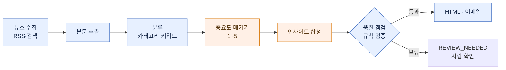

# PR Monitor — Claude Code Plugin

**마케팅·전략기획 팀을 위한 뉴스 모니터링 자동화 플러그인이에요.**

가벼운 뉴스 요약 도구가 아니에요. 회사 평판이나 경쟁사 소식은 하나라도 놓치면 곤란하니까,
매일 외신·국내 기사를 구글뉴스까지 **하나도 빠짐없이** 모은 다음 — 분류하고, 중요도를 매기고,
관련 기사를 묶어 — 정기 브리핑으로 만들어 줍니다(사내 이메일 발송은 선택). 결과물은 두 가지예요:

| 산출물 | 무엇을 답하나 | 들어가는 내용 |
|--------|--------------|------|
| **자사 보도 모니터링** (PR) | "우리가 어떻게 보도됐나" | 자사 언급 기사 + 톤(긍/중/부) + 언급유형(직접/간접)·맥락 한 줄 + 통계 + 월별 엑셀 |
| **업계 인사이트 뉴스레터** | "업계에 무슨 일이 — 우리는 뭘 해야 하나" | 외부 동향 + **자사 전략적 대응점(시사점)** |

**설정은 `/setup` 한 번이면 끝나요.** 자동 리서치가 자사 맥락·경쟁사·키워드·뉴스 소스를 조사해서
워크스페이스에 깔아주고(부족하면 직접 채워 넣어도 돼요), 이메일까지 보낼 거면 관리자 키만 넣으면 됩니다.
그다음부터는 **돌릴 때마다 자사·경쟁사 맥락이 `data/self-context/` 에 차곡차곡 쌓여서**, 다음 브리핑의
전략 시사점이 그 맥락을 참고해 점점 더 쓸 만해져요. 그때그때 요약만 뱉는 도구와 결정적으로 다른 점입니다.

> 이렇게 "다 모으고 → 분류하고 → 합성하는" 과정이 무거운 건, 그냥 뉴스를 가져오는 게 아니라
> **하나도 빠뜨리지 않는 모니터링**이 목표이기 때문이에요. 그래서 LLM과 여러 단계의 전처리를 거칩니다.

수집·분류·렌더링은 **정해진 규칙대로 도는 코드**가 하고, LLM 은 **기사 중요도 매기기·인사이트 합성·PR 톤 판정**
딱 세 곳에만 씁니다. 비용은 대부분 합성(Sonnet)에서 나는데 모은 기사 수·모델·재시도에 따라 달라져요 —
실제 값은 실행 로그(`logs/executions/`)의 `total_cost_usd` 에서 확인할 수 있어요.

> [!IMPORTANT]
> **실행 환경**: 로컬 **Claude Code Desktop 앱** (Windows · macOS). 뉴스 사이트를 직접 긁어오기 때문에
> 네트워크가 필요해요. **Cowork(클라우드)에서는 수집이 막혀 동작하지 않습니다.**

## 결과물 미리보기

`/newsletter` 한 번이면 아래 같은 HTML 뉴스레터가 만들어지고(이메일 인증을 해뒀다면 발송까지) 끝나요.
*(형식 예시예요 — 실제 회사·카테고리 이름은 설정에 따라 채워집니다.)*

```
━━━━━━━━━━━━━━━━━━━━━━━━━━━━━━━━━━━━━━━━━━
 [회사] · INDUSTRY INSIGHT                 2026-06-15
━━━━━━━━━━━━━━━━━━━━━━━━━━━━━━━━━━━━━━━━━━
 TL;DR  이번 기간을 관통하는 한 문장. 그래서 우리한테 뭐가 달라지는지 한 문장.

 인사이트
  ① [거시적 통찰 한 문장 — "그래서 우리는…"이 나오는 제목]
     관찰     외부 기사 2~4건을 한 줄기로 묶어서 [1][2][3]
     자사 함의  경쟁사 기준선과 견줘 우리 위치 + 구체적인 시사점
  ② …    ③ …

 카테고리별 동향
  [카테고리 A]  그날 그 분야 소식을 산문으로 — 헤드라인까지 다 훑게 [4][5][6]
  [카테고리 B]  …

 이번 호 등장 기업   생소한 회사엔 한 줄 설명  ·   출처 (N건)  모든 주장은 URL로 확인 가능
━━━━━━━━━━━━━━━━━━━━━━━━━━━━━━━━━━━━━━━━━━
```

`/pr-clipping` 도 같은 방식으로 **자사 언급 기사 + 톤 라벨(긍정/중립/부정) HTML + 월별 엑셀**을 만들어 줘요.

### 파이프라인



<sub>파란색 = 정해진 코드(LLM 안 씀) · 주황색 = LLM. 수집·추출·분류·점검·렌더는 코드가 하고, 중요도 매기기·인사이트 합성만 LLM이 합니다.</sub>

## 무엇이 다른가

뉴스를 가져다 요약하는 데서 끝나지 않고, **사람이 하던 편집 과정까지 자동화**한 게 핵심이에요. 크게 세 가지입니다.

### 1. 엔진은 하나, 설정은 회사마다

엔진(코드)은 **어느 회사인지·무슨 산업인지 모릅니다.** 회사·경쟁사·카테고리·키워드·뉴스 소스·톤 같은
조직별 정보는 전부 `config/` 폴더의 **설정 묶음(도메인팩)** 에 들어 있고, 엔진은 그걸 읽어서 동작해요.
새 회사는 `/setup` 으로 자기 설정 묶음만 만들면 됩니다 — **엔진은 그대로, 설정만 갈아끼우는** 식이라
회사마다 코드를 따로 고칠 필요가 없어요.

폴더도 셋으로 깔끔하게 나눠 둬서, 플러그인을 업데이트해도 내 설정·데이터는 그대로 남아요:
- **코드(로직)** → 플러그인 안 (`${CLAUDE_PLUGIN_ROOT}`, 읽기 전용 · 업데이트 대상)
- **내 설정·산출물** → 워크스페이스 (`${CLAUDE_PROJECT_DIR}`, 눈에 보이고 백업·이전 가능)
- **비밀 키(이메일 인증)** → 플러그인 설정 → OS 키체인 (YAML에 평문으로 안 둠)
- **venv·캐시** → 숨김 폴더 (`${CLAUDE_PLUGIN_DATA}`, 업데이트해도 보존)

### 2. LLM이 쓴 걸 그대로 믿지 않고, 한 번 더 점검해요

LLM이 쓴 브리핑을 바로 보내지 않아요. 보내기 전에 **규칙으로 점검하는 단계**(코드라서 LLM이 아니에요)가
브리핑을 한 번 훑어서 — 지어낸 사실, 과장, 근거 없는 비약, 금지어 같은 흔한 실수를 걸러냅니다.
문제가 일정 개수를 넘으면 **발송만 멈추고 결과물(HTML)은 남겨 둬요.** 사람이 열어서 확인하고 고친 다음
다시 보내면 됩니다.

> 보통은 "오류 나면 통째로 중단"이지만, 여기선 **"좀 미심쩍으면 일단 멈춰 두기"** 예요 —
> 자동으로 돌리되, 마지막 판단은 사람 몫으로 남겨 둡니다.

### 3. "무슨 주제인가"와 "얼마나 중요한가"를 따로 봐요

기사 한 건을 두고 시스템은 서로 다른 두 질문에 답하는데, 각각 제일 잘 맞는 방식으로 풀어요:

- **무슨 주제인가 → 키워드로 분류.** 어느 카테고리(섹션)에 넣을 기사인지를 설정 키워드로 정합니다.
  LLM을 안 써서 빠르고 비용도 안 들어요.
- **얼마나 중요한가 → LLM이 판단.** 헤드라인으로 키울지 각주로 내릴지, 기사마다 "이 업계 임원에게
  얼마나 중요한가"를 1~5점으로 매깁니다(가벼운 LLM 호출 한 번).

왜 둘 다 필요하냐면 — **키워드는 "이게 무슨 주제인지"는 잘 맞히지만 "얼마나 중요한지"는 못 가려요.**
흔한 단어가 잔뜩 들어간 화제성 기사(이색 기록·이벤트성 시연 같은)가 키워드 점수만 높아서, 정작
자금조달·계약 같은 진짜 중요한 뉴스를 밀어내거든요. 그래서 분류는 키워드로 싸게, 중요도는 판단에 맡깁니다.

중요도 기준은 **특정 산업에 묶여 있지 않아요** — 산업명·언어를 설정에서 받아오니까, 어느 업종에서나
똑같이 동작합니다.

## 설치

```
/plugin marketplace add Wendy-Nam/pr-monitor
/plugin install pr-monitor@news-monitor
```

설치할 때 Azure 이메일 인증(`azure_tenant_id`/`azure_client_id`/`azure_client_secret`/`email_from`)을
물어봐요 — 넣으면 키체인에 안전하게 저장됩니다(건너뛰어도 돼요, 그러면 이메일 발송만 꺼집니다).

첫 세션에서 `SessionStart` 훅이 워크스페이스에 `config/`·`data/` 골격을 깔고 Python venv 를 알아서 만들어요.

## 첫 설정

```
/setup
```
- **딸려 오는 예시 설정(Contoso Motors · EV)으로 바로 시작**하거나,
- **새 회사 자동 초안(추천)** — "회사명 + 산업"만 주면 `setup-bootstrap` 에이전트가 웹에서 경쟁사·카테고리·키워드·소스를 조사해 초안을 만들고, 요약을 보여 주며 확인받아요(완전 자동은 아니에요). 회사당 한 번이면 됩니다.
- **새 회사 직접 입력** — 항목을 하나씩 채워 설정을 만들기.

> 인사이트 예시(`prompt-examples.yaml`)는 그 회사의 **실제 과거 브리핑**이 있어야 만들 수 있어서 자동으로는 안 생겨요 — 빈 양식만 깔리고, 품질용 예시는 운영하면서 직접 채워 넣습니다.

이메일·수신자·키워드·루틴 등록도 `/setup` 에서 해요. (자세한 건 커맨드 안내를 참고하세요.)

## 사용

| 명령 | 동작 |
|------|------|
| `/newsletter [date] [hours]` | 인사이트 뉴스레터 생성·발송 (168=주간) |
| `/pr-clipping [date] [hours]` | 자사 PR 클리핑 생성·발송 (`hours`=수집 시간 범위; 생략하면 기본값) |
| `/setup` | 설정·상태·키·수신자·키워드·루틴 |

자연어로도 돼요 ("오늘 브리핑", "PR 모니터링", "상태 보여줘").

안에서는 크로스플랫폼 CLI 가 돌아갑니다:
```
python3 "${CLAUDE_PLUGIN_ROOT}/prmonitor_launch.py" <pre|post|pr|newsletter|init|paths>
```

## 커스터마이즈 — 어디를 고치면 되나

조직별 설정은 전부 워크스페이스의 `config/`(설정 묶음)와 `data/self-context/`(자사 맥락)에 있어요.
**코드(`prmonitor/`·`scripts/`)는 손댈 필요 없어요.** 바꾸고 싶은 게 뭐냐에 따라 파일만 고치면 됩니다:

| 바꾸고 싶은 것 | 고칠 파일 |
|---|---|
| 회사·경쟁사·카테고리 정의 | `config/company-profile.yaml` |
| 카테고리 이름·색 | `config/categories.yaml` |
| 띄울/뺄 키워드 | `config/keywords.yaml` |
| 뉴스 소스 (RSS·검색어) | `config/sources.yaml` |
| **수집 시간 범위**·발송 주기·메일 제목 | `config/pipelines.yaml` |
| 분류 미세조정 (이해관계자 가중·잡음 거르기) | `config/classify-tuning.yaml` |
| 출력 언어·문장 길이·금지어 | `config/style.yaml` |
| 자사 PR 검색어·톤 판정 사전·매체 이름 | `config/pr-queries.yaml` · `tone-lexicon.yaml` · `media.yaml` |
| 수신자·이메일 인증 | `config/delivery.yaml` |
| 인사이트 품질용 예시 | `config/prompt-examples.yaml` |

**수집 범위를 넓히고 싶으면**: `pipelines.yaml` 의 `hours`(평일)·`monday_hours`(월요일, 주말 몫까지)를
조정하거나, 실행할 때 한 번만 지정해도 돼요 — `/newsletter 2026-06-15 168`(주간), `/pr-clipping 2026-06-15 72`.

### 자사 맥락 (전략 시사점의 밑천)

인사이트의 "자사 함의" 품질은 `data/self-context/` 가 좌우해요:

| 파일 | 내용 | 누가 채우나 |
|---|---|---|
| `company-narrative.md` | 자사 포지셔닝·관계·전략 | **직접** 편집 |
| `competitor-landscape.yaml` | 경쟁사 기준선 | **직접** |
| `key-events.yaml` | 주요 이벤트 | 직접 또는 아래 에이전트 |
| `timeline/{분기}.yaml` | 자사 언급 분기 타임라인 | **자동** — PR 돌 때마다 쌓임 |
| `patterns-observed.md` | 관찰된 외부 흐름 | 에이전트 (아래) |

- **매일 쌓이는 건 자동**이에요. PR 모니터링이 돌 때마다 자사 언급 기사가 분기 타임라인에 자동으로 쌓입니다(LLM 안 씀).
- **정리·승격은 직접 돌리는 걸 권해요.** 쌓인 타임라인을 `patterns-observed.md` 갱신 + `key-events.yaml` 승격으로
  추려 주는 건 `self-context-updater` 에이전트가 하는데, 편집 판단이 필요해서 **자동 스케줄엔 안 넣었어요 — 한 달에 한 번쯤 직접 돌리면 됩니다.**

## 자동 실행 (Routines)

`routines/` 의 두 루틴(PR 평일 10:30, 뉴스레터 월·수·금 09:30)을 `/setup` 의 ROUTINES 에서
등록해 두면 알아서 돌아요. **스케줄 정보는 패키지에 안 담기니까 설치할 때 한 번 등록해 줘야 해요.**
루틴은 데스크탑 앱이 켜져 있을 때만 발화합니다.

## 한계 (솔직하게)

- **품질의 천장은 사람 손에 달려 있어요**: 인사이트 합성에 쓰는 예시(`config/prompt-examples.yaml`)는
  자동으로 안 생깁니다. 새 회사는 형식은 강제되지만, 글의 품질은 운영하면서 직접 다듬어야 해요.
- **Cowork(클라우드)에선 못 써요**: 클라우드 샌드박스가 외부 수집을 막아요. 로컬 데스크탑 전용입니다.

## 개발

```bash
.venv/bin/python3 -m pytest tests/ -q     # 회귀 테스트
python3 -m prmonitor paths                 # 해석된 경로 확인
```
참조 원본은 `ref-pr-monitor/`(분석용 클론, 패키지에는 안 들어감). 설계 상세는 [docs/specs/](docs/specs/) 참고.
