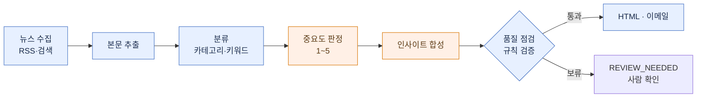

# PR Monitor — Claude Code Plugin

**마케팅·전략기획 팀을 위한 뉴스 모니터링 자동화 플러그인입니다.**

가벼운 뉴스 요약 도구가 아닙니다. 회사 평판과 경쟁사 동향은 하나라도 놓치면 안 되는 영역이라,
매일 외신·국내 보도를 구글뉴스까지 빠짐없이 수집한 뒤 — 분류하고, 중요도를 매기고, 관련 기사를
묶어 — 정기 브리핑으로 만듭니다(사내 이메일 발송은 선택). 산출물은 두 가지입니다.

| 산출물 | 무엇을 답하나 | 들어가는 내용 |
|--------|--------------|------|
| **자사 보도 모니터링** (PR) | "우리가 어떻게 보도됐나" | 자사 언급 기사 + 톤(긍/중/부) + 언급유형(직접/간접)·맥락 한 줄 + 통계 + 월별 엑셀 |
| **업계 인사이트 뉴스레터** | "업계에 무슨 일이 — 우리는 뭘 해야 하나" | 외부 동향 + **자사 전략적 대응점(시사점)** |

**설정은 `/setup` 한 번이면 됩니다.** 자동 리서치가 자사 맥락·경쟁사·키워드·뉴스 소스를 조사해
워크스페이스에 구성하고(필요하면 직접 보완), 이메일까지 보내려면 관리자 키만 입력하면 됩니다.
이후로는 **실행할 때마다 자사·경쟁사 맥락이 `data/self-context/` 에 누적되어**, 다음 브리핑의 전략
시사점이 그 맥락을 참고해 점점 정교해집니다. 그때그때 요약만 내놓는 도구와 결정적으로 다른 지점입니다.

> "다 모으고 → 분류하고 → 합성하는" 과정이 무거운 이유는, 단순히 뉴스를 가져오는 게 아니라
> **누락 없는 모니터링**이 목표이기 때문입니다. 그래서 LLM과 여러 단계의 전처리를 거칩니다.

수집·분류·렌더링은 **정해진 규칙대로 도는 코드**가 처리하고, LLM 은 **기사 중요도 판정·인사이트
합성·PR 톤 판정** 세 곳에만 씁니다. 비용은 대부분 합성(Sonnet)에서 발생하며 수집 기사 수·모델·
재시도에 따라 달라집니다 — 실제 값은 실행 로그(`logs/executions/`)의 `total_cost_usd` 에서 확인합니다.

> [!IMPORTANT]
> **실행 환경**: 로컬 **Claude Code Desktop 앱** (Windows · macOS). 뉴스 사이트를 직접 수집하므로
> 네트워크가 필요합니다. **Cowork(클라우드)에서는 수집이 차단되어 동작하지 않습니다.**

## 결과물 미리보기

`/newsletter` 한 번이면 아래 형식의 HTML 뉴스레터가 만들어지고(이메일 인증을 해뒀다면 발송까지) 끝납니다.
*(형식 예시입니다 — 실제 회사·카테고리 이름은 설정에 따라 채워집니다.)*

```
━━━━━━━━━━━━━━━━━━━━━━━━━━━━━━━━━━━━━━━━━━
 [회사] · INDUSTRY INSIGHT                 2026-06-15
━━━━━━━━━━━━━━━━━━━━━━━━━━━━━━━━━━━━━━━━━━
 TL;DR  이번 기간을 관통하는 한 문장. 그래서 우리에게 무엇이 달라지는지 한 문장.

 인사이트
  ① [거시적 통찰 한 문장 — "그래서 우리는…"이 나오는 제목]
     관찰     외부 기사 2~4건을 한 줄기로 묶어 [1][2][3]
     자사 함의  경쟁사 기준선과 견준 우리 위치 + 구체적 시사점
  ② …    ③ …

 카테고리별 동향
  [카테고리 A]  그날 그 분야 소식을 산문으로 — 헤드라인까지 한눈에 [4][5][6]
  [카테고리 B]  …

 이번 호 등장 기업   생소한 회사에는 한 줄 설명  ·   출처 (N건)  모든 주장은 URL로 검증 가능
━━━━━━━━━━━━━━━━━━━━━━━━━━━━━━━━━━━━━━━━━━
```

`/pr-clipping` 도 같은 방식으로 **자사 언급 기사 + 톤 라벨(긍정/중립/부정) HTML + 월별 엑셀**을 만듭니다.

### 파이프라인



<sub>파란색 = 정해진 코드(LLM 미사용) · 주황색 = LLM. 수집·추출·분류·점검·렌더는 코드가, 중요도 판정·인사이트 합성만 LLM이 담당합니다.</sub>

## 무엇이 다른가

뉴스를 가져와 요약하는 데서 끝나지 않고, **사람이 하던 편집 판단까지 자동화**한 것이 핵심입니다. 크게 세 가지입니다.

### 1. 엔진은 하나, 설정은 회사마다

엔진(코드)은 **어느 회사인지, 무슨 산업인지 모릅니다.** 회사·경쟁사·카테고리·키워드·뉴스 소스·톤 같은
조직별 정보는 전부 `config/` 의 **설정 묶음(도메인팩)** 에 들어 있고, 엔진은 이를 읽어 동작합니다.
새 회사는 `/setup` 으로 자기 설정 묶음만 만들면 됩니다 — **엔진은 그대로 두고 설정만 교체**하므로
회사마다 코드를 따로 고칠 필요가 없습니다.

폴더도 세 곳으로 분리해, 플러그인을 업데이트해도 사용자 설정·데이터는 보존됩니다.
- **코드(로직)** → 플러그인 내부 (`${CLAUDE_PLUGIN_ROOT}`, 읽기 전용 · 업데이트 대상)
- **설정·산출물** → 워크스페이스 (`${CLAUDE_PROJECT_DIR}`, 사용자가 직접 보고 백업·이전 가능)
- **비밀 키(이메일 인증)** → 플러그인 설정 → OS 키체인 (YAML 평문 저장 안 함)
- **venv·캐시** → 숨김 폴더 (`${CLAUDE_PLUGIN_DATA}`, 업데이트해도 보존)

### 2. LLM이 쓴 결과를 그대로 믿지 않고 검증합니다

LLM이 작성한 브리핑을 바로 발송하지 않습니다. 발송 전, **규칙 기반 점검 단계**(코드이며 LLM이 아닙니다)가
브리핑을 검사해 — 지어낸 사실, 과장, 근거 없는 비약, 금지어 같은 흔한 오류를 걸러냅니다.
문제가 일정 개수를 넘으면 **발송만 중단하고 결과물(HTML)은 남깁니다.** 사람이 열어 확인·수정한 뒤
다시 보내면 됩니다.

> 일반적인 "오류 시 전체 중단(fail-closed)"이 아니라 **"의심되면 일단 멈춰 둔다(fail-held)"** 방식입니다.
> 자동으로 돌리되, 최종 판단은 사람이 합니다.

### 3. "무슨 주제인가"와 "얼마나 중요한가"를 따로 판단합니다

기사 한 건에 대해 시스템은 서로 다른 두 질문에 답하며, 각각 가장 적합한 방식으로 처리합니다.

- **무슨 주제인가 → 키워드 분류.** 어느 카테고리(섹션)에 들어갈 기사인지를 설정 키워드로 정합니다.
  LLM을 쓰지 않아 빠르고 비용이 들지 않습니다.
- **얼마나 중요한가 → LLM 판단.** 헤드라인으로 키울지 각주로 내릴지, 기사마다 "이 업계 임원에게
  얼마나 중요한가"를 1~5점으로 매깁니다(가벼운 LLM 호출 1회).

두 가지가 모두 필요한 이유는 — **키워드는 "주제 분류"는 잘하지만 "중요도 판단"은 못 하기 때문입니다.**
흔한 단어가 많은 화제성 기사(이색 기록·이벤트성 시연 등)가 키워드 점수만 높아, 정작 자금조달·계약 같은
핵심 뉴스를 밀어냅니다. 그래서 분류는 키워드로 저렴하게, 중요도는 판단에 맡깁니다.

중요도 기준은 **특정 산업에 묶이지 않습니다** — 산업명·언어를 설정에서 받으므로 어느 업종에서나 동일하게 동작합니다.

## 설치

```
/plugin marketplace add Wendy-Nam/pr-monitor
/plugin install pr-monitor@news-monitor
```

설치 시 Azure 이메일 인증(`azure_tenant_id`/`azure_client_id`/`azure_client_secret`/`email_from`)을
물어봅니다 — 입력하면 키체인에 안전하게 저장됩니다(건너뛰어도 되며, 그 경우 이메일 발송만 비활성화됩니다).

첫 세션에서 `SessionStart` 훅이 워크스페이스에 `config/`·`data/` 골격을 만들고 Python venv 를 자동 구축합니다.

## 첫 설정

```
/setup
```
- **함께 제공되는 예시 설정(Contoso Motors · EV)으로 바로 시작**하거나,
- **새 회사 자동 초안(권장)** — "회사명 + 산업"만 주면 `setup-bootstrap` 에이전트가 웹에서 경쟁사·카테고리·키워드·소스를 조사해 초안을 만들고, 요약을 제시해 확인받습니다(완전 자동은 아닙니다). 회사당 한 번이면 됩니다.
- **새 회사 직접 입력** — 항목을 하나씩 채워 설정을 생성.

> 인사이트 예시(`prompt-examples.yaml`)는 해당 회사의 **실제 과거 브리핑**이 있어야 만들 수 있어 자동 생성되지 않습니다 — 빈 양식만 깔리며, 품질용 예시는 운영하면서 직접 채워 넣습니다.

이메일·수신자·키워드·루틴 등록도 `/setup` 에서 합니다. (자세한 내용은 커맨드 안내를 참고하세요.)

## 사용

| 명령 | 동작 |
|------|------|
| `/newsletter [date] [hours]` | 인사이트 뉴스레터 생성·발송 (168=주간) |
| `/pr-clipping [date] [hours]` | 자사 PR 클리핑 생성·발송 (`hours`=수집 시간 범위; 생략 시 기본값) |
| `/setup` | 설정·상태·키·수신자·키워드·루틴 |

자연어로도 동작합니다 ("오늘 브리핑", "PR 모니터링", "상태 보여줘").

내부적으로는 크로스플랫폼 CLI 가 동작합니다.
```
python3 "${CLAUDE_PLUGIN_ROOT}/prmonitor_launch.py" <pre|post|pr|newsletter|init|paths>
```

## 커스터마이즈 — 어디를 고치면 되나

조직별 설정은 전부 워크스페이스의 `config/`(설정 묶음)와 `data/self-context/`(자사 맥락)에 있습니다.
**코드(`prmonitor/`·`scripts/`)는 손댈 필요가 없습니다.** 바꾸려는 대상에 따라 해당 파일만 수정하면 됩니다.

| 바꾸려는 것 | 고칠 파일 |
|---|---|
| 회사·경쟁사·카테고리 정의 | `config/company-profile.yaml` |
| 카테고리 이름·색 | `config/categories.yaml` |
| 띄울/뺄 키워드 | `config/keywords.yaml` |
| 뉴스 소스 (RSS·검색어) | `config/sources.yaml` |
| **수집 시간 범위**·발송 주기·메일 제목 | `config/pipelines.yaml` |
| 분류 미세조정 (이해관계자 가중·잡음 제거) | `config/classify-tuning.yaml` |
| 출력 언어·문장 길이·금지어 | `config/style.yaml` |
| 자사 PR 검색어·톤 판정 사전·매체 이름 | `config/pr-queries.yaml` · `tone-lexicon.yaml` · `media.yaml` |
| 수신자·이메일 인증 | `config/delivery.yaml` |
| 인사이트 품질용 예시 | `config/prompt-examples.yaml` |

**수집 범위를 넓히려면**: `pipelines.yaml` 의 `hours`(평일)·`monday_hours`(월요일, 주말 몫 포함)를
조정하거나, 실행 시 한 번만 지정해도 됩니다 — `/newsletter 2026-06-15 168`(주간), `/pr-clipping 2026-06-15 72`.

### 자사 맥락 (전략 시사점의 근거)

인사이트의 "자사 함의" 품질은 `data/self-context/` 가 좌우합니다.

| 파일 | 내용 | 갱신 주체 |
|---|---|---|
| `company-narrative.md` | 자사 포지셔닝·관계·전략 | **직접** 편집 |
| `competitor-landscape.yaml` | 경쟁사 기준선 | **직접** |
| `key-events.yaml` | 주요 이벤트 | 직접 또는 아래 에이전트 |
| `timeline/{분기}.yaml` | 자사 언급 분기 타임라인 | **자동** — PR 실행마다 누적 |
| `patterns-observed.md` | 관찰된 외부 흐름 | 에이전트 (아래) |

- **매일의 누적은 자동입니다.** PR 모니터링이 실행될 때마다 자사 언급 기사가 분기 타임라인에 쌓입니다(LLM 미사용).
- **정리·승격은 직접 실행을 권장합니다.** 누적된 타임라인을 `patterns-observed.md` 갱신과 `key-events.yaml` 승격으로
  추려내는 작업은 `self-context-updater` 에이전트가 맡는데, 편집 판단이 필요해 **자동 스케줄에 넣지 않았습니다 — 월 1회 정도 직접 실행하면 됩니다.**

## 정기 자동 실행 (Routines)

정해진 시각에 브리핑을 자동으로 돌리려면 **루틴을 한 번 등록해야 합니다. 등록은 수동 단계입니다** —
한 번 등록해 두면 그 뒤로는 정해진 시각에 알아서 실행됩니다.

등록 방법 (`/setup` 의 ROUTINES 가 단계별로 안내합니다):

1. `routines/` 에 두 루틴 정의가 들어 있습니다 — `pr-monitoring-daily`(PR 평일), `newsletter-insight-mwf`(뉴스레터 월·수·금).
2. 이를 **데스크탑 앱의 Routines 화면에서 추가**하거나 scheduled-tasks 로 등록합니다. 작업 경로는 `/setup` 이 워크스페이스 경로로 자동 채워 줍니다.
3. 등록 후 각 루틴을 **"Run Now" 로 한 번 실행**합니다 — 뉴스 수집·이메일·파일 접근 권한을 미리 허용해 두기 위해서입니다.
4. 실행 시각은 Routines 화면에서 조정합니다 (기본값: PR 평일 10:30, 뉴스레터 월·수·금 09:30).

주의할 점:

- **등록 정보는 플러그인 패키지에 담기지 않습니다.** 스케줄은 앱/scheduled-tasks 쪽에 따로 저장되므로,
  플러그인을 처음 설치했거나 새 기기에 깔았을 때는 위 등록을 한 번 해줘야 합니다.
- 루틴은 **데스크탑 앱이 켜져 있을 때만** 발화합니다. (Cowork·클라우드에서는 동작하지 않습니다.)

## 알아둘 제약

- **인사이트 글의 완성도는 직접 다듬어야 합니다.** 합성에 쓰는 예시(`config/prompt-examples.yaml`)는
  자동으로 생성되지 않습니다. 형식은 시스템이 맞춰 주지만, 글 자체의 품질은 운영하면서 좋은 예시를 채워 올려야 합니다.
- **클라우드(Cowork)에서는 동작하지 않습니다.** 샌드박스가 외부 뉴스 수집을 차단하기 때문이며, 로컬 데스크탑 앱 전용입니다.

## 개발

```bash
.venv/bin/python3 -m pytest tests/ -q     # 회귀 테스트
python3 -m prmonitor paths                 # 해석된 경로 확인
```
참조 원본은 `ref-pr-monitor/`(분석용 클론, 패키지 미포함). 설계 상세는 [docs/specs/](docs/specs/) 참고.
